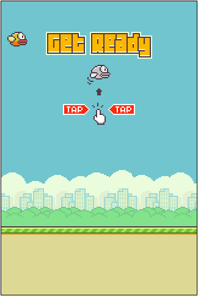
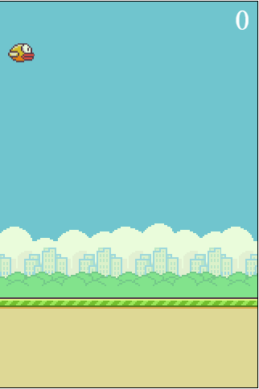
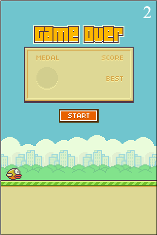
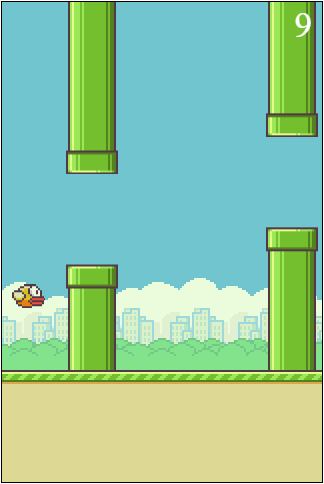
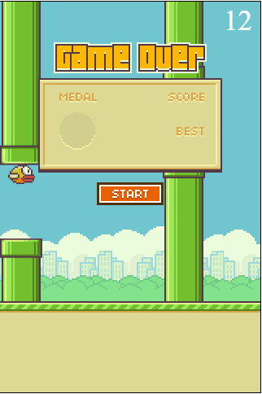
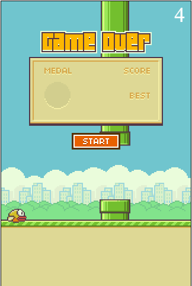

#  Jogo - Flappy Bird

Jogo Flappy Bird desenvolvido em javaScript puro.

## Aula 01
1. Setupe inicial do canvas;
2. Desenhar o Flappy Bird na tela;
3. Game Loop;
4. Desenhar o resto do cenário;

## Aula 02
1. Passarinho Caindo;
2. Troca de Tela;
3. Adicionar Tela Inicio;

## Aula 03
1. Colisão com o chão;
2. Soco do Ryu na queda;
3. Adicionar Tela Inicio;
4. Passarinho Subindo;

## Aula 04
1. Chão movimentando;
2. Animar passarinho;
3. Adicionar Tela Inicio;
4. Passarinho Subindo;

## Aula 05
1. Desenhar Canos;
2. Canos movimentando;
3. Colisão com Canos;
4. Passarinho Subindo;

## Aula 06
1. Tela de Game Over;
2. Pontuação;

# 📱 ScreenShot Do Jogo Flappy Bird

<h1 align="center">💻 Desenvolvido Por: Gilberto Júnior</h1>
